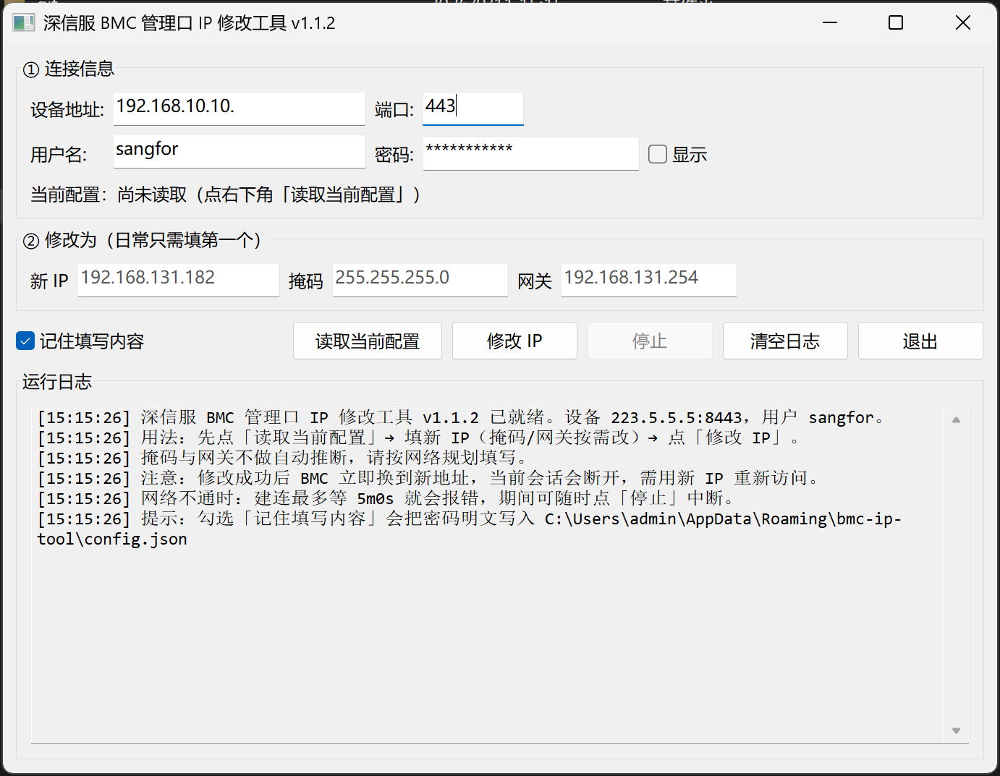

# 深信服 BMC 管理口 IP 修改工具（Sangfor BMC IP Tool）

[](https://go.dev/)
[](https://www.microsoft.com/)
[](#许可证-license)

一个带图形界面的 Windows 小工具，用于通过 **Redfish 接口** 修改深信服（Sangfor）服务器 BMC 管理口的 IPv4 地址、子网掩码与默认网关。
登录凭据、Redfish 请求流程均依据真实浏览器抓包（`192.168.10.10.har`）还原，并针对真机做了多种容错。

---

## 功能特性

- **图形化操作**：填设备地址 + 账号密码，点「读取当前配置」自动带出当前 IP/掩码/网关，改完点「修改 IP」即可下发。
- **停止按钮**：网络不通或设备无响应时，可随时点「停止」中断在途请求，无需重启（建连超时压到 8 秒，并基于 `context` 真正取消）。
- **登录体自动降级**：依固件版本不同，依次尝试「标准登录（带 `Oem.Public`）→ 简化登录 → 兼容登录（`LoginTag=0`）」。
- **认证头自动降级**：同时下发 `X-Auth-Token` 与 `X-XSRF-TOKEN`，遇 `401/403` 自动切换为仅一种或 `Authorization: Bearer`。
- **乐观锁重试**：PATCH 带 `If-Match`（`ETag`）；遇到 `412` 会自动重读配置后重试一次。
- **配置持久化**：勾选「记住填写内容」可把连接信息写入本地配置文件（密码为明文，见[安全说明](#安全说明)）。
- **自包含测试桩**：内置 `BmcMock` 模拟服务端，无需真机即可端到端联调，默认按抓包严格校验。

---

## 界面预览



主界面字段：

| 区域 | 控件 | 说明 |
| --- | --- | --- |
| 连接信息 | 设备地址 / 端口 / 用户名 / 密码 | 默认端口 `443`；密码框带「显示密码」勾选 |
| 当前配置 | 当前配置（摘要行） | 点「读取当前配置」后显示设备带出的 IP/掩码/网关/管理口 |
| 新配置 | 新 IP / 掩码 / 网关 | 掩码与网关可留空，点读取后自动带出再手改 |
| 操作 | 读取当前配置 / 修改 IP / 停止 / 清空日志 / 退出 | 「停止」仅在长操作进行时可点 |

---

## 使用说明

1. 运行 `BmcIpTool.exe`（或在源码目录 `go run .`）。
2. 填写 **设备地址**（如 `192.168.10.10`）、**端口**（默认 `443`）、**用户名 / 密码**。
3. 点 **读取当前配置**：工具登录并 `GET /redfish/v1/Managers/1/EthernetInterfaces/eth0`，把当前配置显示在摘要行。
4. 在「新 IP / 掩码 / 网关」中填写要改成的静态地址（掩码、网关可按需沿用读取带出的值）。
5. 点 **修改 IP**：工具用 `PATCH` 下发 `{"IPv4Addresses":[{"AddressOrigin":"Static",...}]}`，成功后日志提示服务端已接受。
6. 若中途设备无响应，点 **停止** 即可中断，界面立即恢复可用。

> **默认凭据**：本工具针对深信服 BMC 默认账号 `sangfor` / `S#AN$6fo81r` 设计（抓包中的账号密码）。实际使用时按你设备的真实凭据填写即可。

---

## 工作原理（Redfish 流程）

```
登录   POST /redfish/v1/SessionService/Sessions
          body: {"UserName","Password","Oem":{"Public":{"EncryptFlag":false,"LoginTag":<int>,"SessionType":"WebUI"}}}
          resp: Oem.Public["X-Auth-Token"]  ← 后续请求的令牌

查询   GET  /redfish/v1/Managers/1/EthernetInterfaces/eth0
          resp header: ETag  ← 乐观锁

修改   PATCH 同一路径
          header: If-Match: "<ETag>"
          body:   {"IPv4Addresses":[{"AddressOrigin":"Static","Address","SubnetMask","Gateway"}]}

登出   DELETE /redfish/v1/SessionService/Sessions/{Id}
```

- 连接使用 **HTTPS + 自签名证书跳过校验**（内网 BMC 普遍使用自签证书）。
- 管理口资源路径会先自动探测（`/redfish/v1/Managers` → `EthernetInterfaces`），探测失败回落到抓包中的固定路径 `.../eth0`。

---

## 编译（Build）

要求 **Go 1.21+**（本项目用 1.26.5 验证），Windows 平台。

```bat
cd bmc-ip-tool
build.bat
```

`build.bat` 会：先跑全部测试 `go test ./...`，再用 `rsrc`（若已安装）生成 Windows 资源（现代控件样式 + DPI 感知），最后编译出两个 exe：

- `BmcIpTool.exe` —— 图形化改 IP 工具（`-ldflags="-H windowsgui"` 无控制台窗口）
- `BmcMock.exe` —— 模拟服务端（测试用，带控制台）

也可手动编译：

```bat
go build -trimpath -ldflags="-H windowsgui -s -w" -o BmcIpTool.exe .
go build -trimpath -ldflags="-s -w" -o BmcMock.exe ./bmcmock
```

> 内核使用纯 Go 的 [`lxn/walk`](https://github.com/lxn/walk) 库，无需 C 编译器（CGO 关闭即可）。

---

## 模拟端（测试用）

在没有真实 BMC 时，用 `BmcMock.exe` 代替真机验证工具是否真的对得上接口。它按抓包还原协议，并**默认严格校验**登录体、`If-Match`、认证头与 PATCH 报文，任何不符都会返回真实风格的错误——跑通模拟端才等价于能对上真机。

```bat
BmcMock.exe
```

默认监听 `https://127.0.0.1:8443`，并在 `http://127.0.0.1:18080` 提供状态面板（实时显示管理口当前值与请求记录）。
在工具里填 `127.0.0.1` / 端口 `8443` / 账号 `sangfor` / 密码 `S#AN$6fo81r` 即可联调。

### 常用命令行参数

| 参数 | 默认值 | 说明 |
| --- | --- | --- |
| `-listen` | `0.0.0.0:8443` | HTTPS 监听地址（被测工具连这个） |
| `-http` | `0.0.0.0:18080` | 状态面板地址，留空则不启用 |
| `-user` / `-pass` | `sangfor` / `S#AN$6fo81r` | 登录账号密码 |
| `-ip` / `-mask` / `-gw` | `192.168.10.10` / `255.255.255.0` / `192.168.10.1` | 初始管理口配置 |
| `-dhcp` | 关 | 初始为 DHCP 模式 |
| `-latency` | `0` | 每个请求的人为延迟，如 `300ms` |
| `-loose-login` | 关 | 关闭登录体严格校验 |
| `-reject-oem-login` | 关 | 模拟老固件：登录体带 `Oem` 就拒绝 |
| `-loose-etag` | 关 | 关闭 `If-Match` 校验 |
| `-auth` | `any` | 服务端认哪种认证头：`any` / `x-auth-token` / `x-xsrf-token` / `bearer` |
| `-strict-one-auth` | 关 | 只接受单一认证头（逼出客户端降级逻辑） |
| `-fail-first-login` | 关 | 首次登录返回 400（验证登录体降级） |
| `-fail-first-patch` | 关 | 首次 PATCH 返回 412（验证重取 ETag 重试） |
| `-drop-after-patch` | 关 | PATCH 成功后掐断连接（模拟设备立即切走地址） |
| `-no-color` | 关 | 关闭彩色日志输出 |

示例 —— 验证客户端的 `412` 重试与老固件降级：

```bat
BmcMock.exe -fail-first-patch -reject-oem-login
```

---

## 目录结构

```
bmc-ip-tool/
├── main.go             # walk GUI：连接信息、读取/修改、停止、日志、配置持久化
├── redfish.go          # Redfish 客户端：登录/查询/修改/登出、超时与容错、错误归类
├── redfish_test.go     # 单元测试（含取消中断、超时归类）
├── e2e_test.go         # 端到端测试（真实 TLS 联调模拟端）
├── mockbmc/            # 模拟服务端实现（严格按抓包校验）
│   └── mockbmc.go
├── bmcmock/            # 模拟端启动器 + 彩色日志 + 状态面板
│   └── main.go
├── app.manifest        # 现代控件样式 + DPI 感知 + asInvoker
├── rsrc.syso           # 由 app.manifest 生成的 Windows 资源
├── build.bat           # 测试 + 编译一键脚本
├── go.mod / go.sum
└── screenshot.png      # 界面截图
```

---

## 安全说明

- **密码明文存储**：勾选「记住填写内容」时，密码会以明文写入本地配置文件（路径回落到 `%USERPROFILE%\AppData\Roaming` 或 `~/.config`）。仅在可信单机环境使用，不要在共享/公共机器上勾选。
- **证书校验跳过**：客户端对 BMC 自签名证书执行 `InsecureSkipVerify`（内网设备管理口普遍如此）。请确保你确实连的是目标设备，避免中间人风险。
- **内网用途**：工具强制不走系统代理，面向数据中心/机房内网运维场景。

---

## 常见问题

**Q：点「读取当前配置」一直转圈、无法停止？**
A：旧版本存在此问题，当前版本已加入「停止」按钮与 8 秒建连超时。若仍卡住，确认设备地址/端口正确、设备在线且网络可达。

**Q：登录提示认证失败？**
A：检查用户名/密码；个别老固件不接受 `Oem` 登录参数，工具会自动降级为简化登录体。

**Q：修改被拒绝（HTTP 412 / ETag 过期）？**
A：说明配置在两次操作之间被改过（如网页端）。工具会自动重读后重试一次；仍失败则手动再点一次「读取当前配置」。

**Q：没有真实设备怎么测试？**
A：用 `BmcMock.exe` 模拟端，见上文「模拟端」一节。

---

## 许可证（License）

[MIT](LICENSE) © 2026
